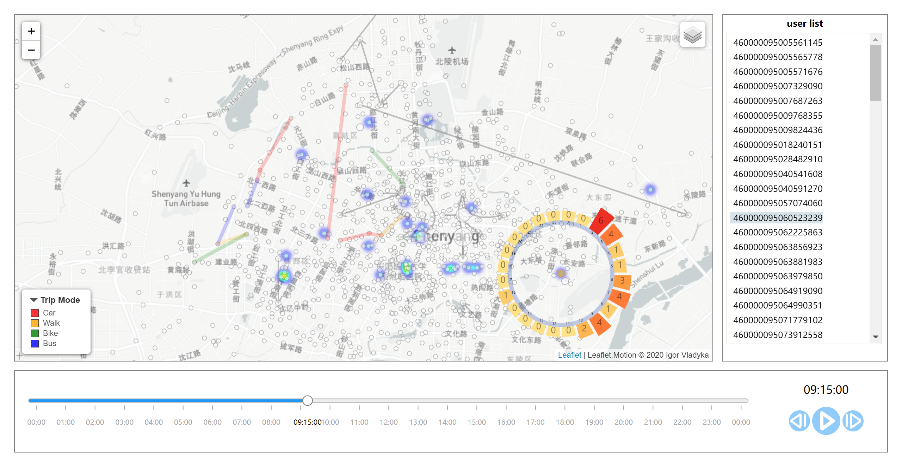

# SVAG

## 0、总效果图

### 地图层

- 使用的库（含自定义库）：d3.js@5，jquery.js@3.4.1，leaflet.js@1.6.0，d3-edgeBundle.js，leaflet-heat.js，leaflet.markercluster.js，leaflet.polylineDecorator.js，leaflet.motion.js，leaflet-legend.js，leaflet-d3-SvgOverlay.js 。
- 地图层有灰度地图和街道地图两种，可通过视图右上角的图层控制器选择。

### 时间轴

- 使用的库：d3.js@5，d3-simple-slider.js

- 时间轴以5分钟为步长，可通过移动圆形滑动条进行控制，当前时间将在时间轴坐标上和视图右下角显示。
- 点击视图右下角的播放按钮，将会模拟时钟变换，默认以5分钟为步长，点击加速和减速按钮可以控制播放速度，以2倍进行递增递减，倍数范围为【1，60】。

## 1、空间流动视图

- **数据**：spaceStayDataset.json、spaceTripDataset.json、stationBoxesMap.json为基础绘制，每5分钟进行改变。

- 将基站映射为方格，以方格的几何中心来表示。

- **元素：**圆圈表示驻留基站，圆圈大小编码驻留流量；边表示出行，边的宽度编码出行流量。

- **交互：**单击或者悬浮在点和边上，将显示详细信息。

- **待解决的问题：** 驻留流量为零的基站是否需要画出来？

  - 目前处理方案：如果这个零流量的驻留基站是某条出行边的端点（类型①点），那么用最小的半径把它画出来，其他零流量的驻留基站（类型②点）不画。

  - ①和②都不画，只有边显得比较奇怪。
  - ①和②都画，点太多会重叠在一起。 

## 2、个体轨迹视图

- **数据**：TripModeResult.csv、newStation.csv为基础绘制。

-  在到达结束时刻的时候才把轨迹画出来。 

- **元素：**边表示出行轨迹，边的颜色类别编码出行方式（绘制边时将出现 交通工具的图标动画），边的颜色深浅编码出行速度。

- **交互：**

  - 单击右侧用户列表，进行用户数据切换。

  - 单击或者悬浮在边上，将显示详细信息。
  - 单击图例标题，可以将图例折叠。

## 3、空间流量分布视图

- **数据：**spaceFlowDataset.json和newStation.csv为基础绘制，每5分钟进行改变。
- **元素：**热力图，颜色编码空间流量。
- **交互：**标签图层 单击查看基站经纬度和流量信息，当标签过多时，会以数字气泡的形式展示，单击气泡可放大查看标签详情。

## 4、特定地点时序流量视图

- **数据**：spaceFlowDataset.json和newStation.csv为基础绘制，以1小时统计流量。

- **元素：**圆圈表示基站；柱表示24小时的时序流量数据，柱的高度和颜色编码流量。

- **交互：**

  - 单击基站圆圈，该基站高亮显示，同时绘制时序流量图，再次单击，该基站取消高亮，移除时序流量图。可同时绘制多点的时序流量图。

  - 悬浮在柱上，将高亮该柱。